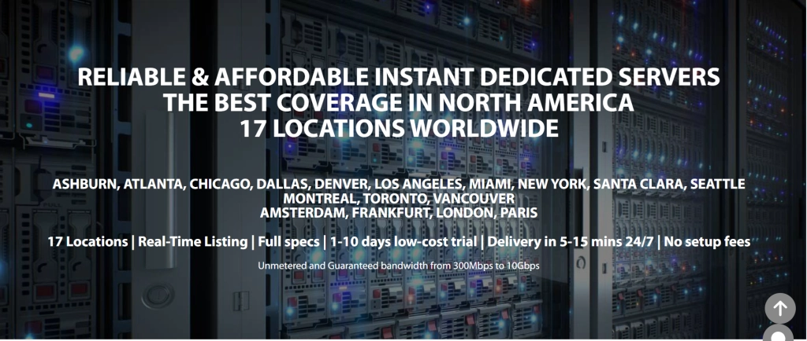
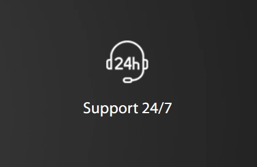

# GTHost评测：全球17个数据中心的服务器托管平台

你的客户分布在世界各地？服务器距离大部分用户太远，导致访问速度慢？想要覆盖地球另一端的市场，同时保持出色的访问速度？GTHost可能就是你需要的解决方案。这个托管平台在全球拥有17个数据中心，让你可以根据目标市场选择最近的服务器位置，并按实际需求自定义存储空间——不用为用不上的资源买单。

---

## GTHost是什么

GTHost（全称GLOBALTELEHOST Corp.）成立于2012年，目标很明确：让全球各地的企业都能用上性能可靠、价格合理的服务器托管服务。

这个平台最大的特点是**灵活定制**。你不用从几个固定套餐里硬挑一个，而是可以像搭积木一样，根据自己需要的存储空间和服务器位置来构建方案。比如你主要服务欧洲客户，就选阿姆斯特丹或法兰克福的机房；如果业务在东南亚，新加坡或日本的节点更合适。

## 全球17个数据中心位置

GTHost的机房覆盖了这些地区：

**北美：** 美国多个城市、加拿大  
**欧洲：** 英国、德国、法国、荷兰  
**亚太：** 日本、新加坡、澳大利亚  
**其他：** 南美、中东等地区

这种分布有什么用？简单说，服务器离用户越近，网页加载就越快。如果你的客户主要在欧洲，选个欧洲机房，访问速度能比用美国服务器快好几倍。这不是技术细节，是实实在在影响用户体验和转化率的事。

## 安全防护怎么样

数据这东西，丢了可不是重新下载那么简单。GTHost在安全上有两个基本保障：

**DDoS攻击防护：** 有人恶意攻击你的服务器时，平台会自动拦截这些流量，保证你的网站正常运行。同时，他们也不允许用户从自己的服务器发起攻击——这点挺重要的，说明平台在认真管理，不是随便什么人都能乱来。

**SSL加密：** 你网站和用户之间传输的数据都会被加密，别人截获了也看不懂。现在浏览器对没有SSL的网站会显示"不安全"警告，这个基本是标配了。

👉 [想要在全球范围内快速部署服务器？看看GTHost的灵活定制方案](https://cp.gthost.com/en/join/72c7e6b2fc118929f9ede2978f008806)

## 客户支持能不能靠得住

换服务器这事，刚开始总会遇到各种问题。GTHost提供24/7全天候技术支持，可以通过电话、在线聊天或邮件联系。

他们针对不同类型的问题提供了专门的邮箱地址——账单问题发一个邮箱，技术问题发另一个。这样分类处理效率会高一些，不用把所有问题都扔到一个邮箱里等着慢慢排队。

## 几个值得注意的功能

**不限流量：** 有些托管商会限制每月的数据传输量，超了就要加钱。GTHost没有这个限制，你的网站流量再大也不用担心突然被收额外费用。对于流量波动大的业务来说，这个挺实用的。

**快速部署：** 买完服务器后，5到15分钟就能开始使用。不用等几个小时甚至一天才能拿到服务器权限。

**完整Root权限：** 你对服务器有完全控制权，想装什么软件、改什么配置都可以。这对技术团队来说很重要，不会被平台限制住手脚。

## 价格怎么算

GTHost主要提供的是独立服务器方案，价格根据你选择的配置和机房位置计算。起步价大概是每月59美元，具体费用取决于：

- 选哪个数据中心（不同地区价格可能有差异）
- 需要多少存储空间
- CPU和内存配置
- 是否需要额外的备份或安全服务

这种定价方式的好处是，你只为真正需要的资源付费，不会像固定套餐那样，为了用上某个功能不得不买一堆用不上的东西。

## 适合什么样的用户

如果你的业务有这些特点，GTHost会比较合适：

- 客户分布在多个国家或地区，需要在不同位置部署服务器
- 对服务器配置有特定要求，固定套餐满足不了
- 流量波动大，不想为流量超限担心
- 需要完整的服务器控制权，要装自己的软件环境

不太适合的情况：新手小白，只是想放个简单的展示网站，那种几百块一年的虚拟主机可能更合适。GTHost的独立服务器更偏向有一定技术能力或者有明确业务需求的用户。

## 常见问题

**有免费试用吗？**  
不是完全免费，但GTHost提供1-10天的低价试用期。具体条款建议看他们网站的服务条款页面，避免理解出入。

**最便宜的方案多少钱？**  
独立服务器起步价约59美元/月，实际价格看你选的配置。

**遇到问题怎么联系？**  
可以通过在线聊天、电话或邮件。他们对不同类型的问题（账单、技术等）提供了不同的联系方式，这样处理起来会快一些。

**提供独立服务器吗？**  
是的，GTHost主要就是做独立服务器的。你可以选择机房位置和所需的存储配置，价格从59美元/月起步。

---

## 总结

GTHost的核心优势在于**灵活性和全球覆盖**。17个数据中心意味着无论你的目标市场在哪，都能找到距离比较近的服务器位置。不限流量的政策让你不用担心业务增长带来的额外成本。DDoS防护和SSL加密提供了基本的安全保障。

这个平台比较适合对服务器有明确需求、希望自由控制配置的用户。如果你需要在全球多个地区部署服务，又想避免为用不上的功能买单，👉 [GTHost的自定义方案值得考虑](https://cp.gthost.com/en/join/72c7e6b2fc118929f9ede2978f008806)。

唯一需要注意的是，试用条款可能不够直观，建议在购买前仔细确认具体政策。
